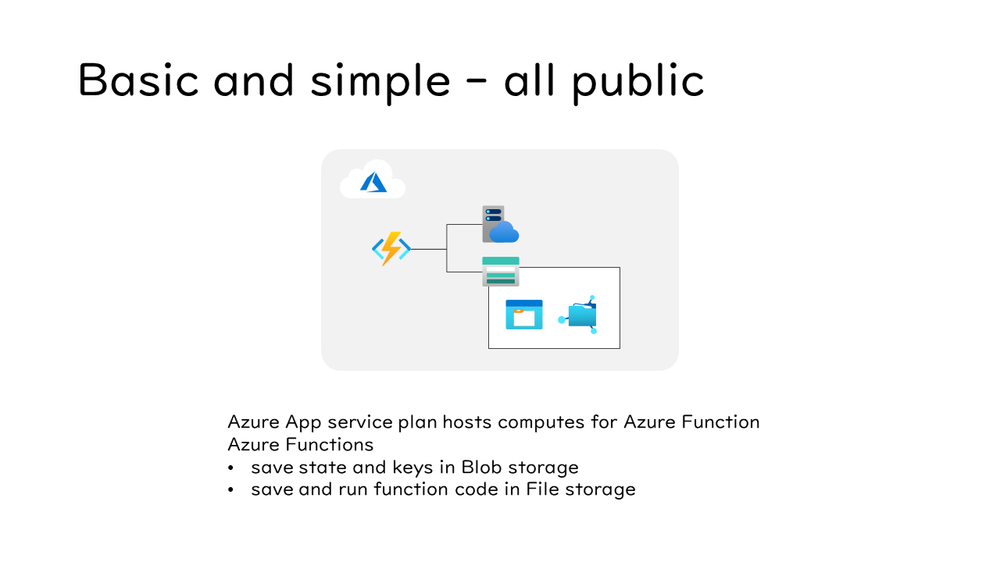
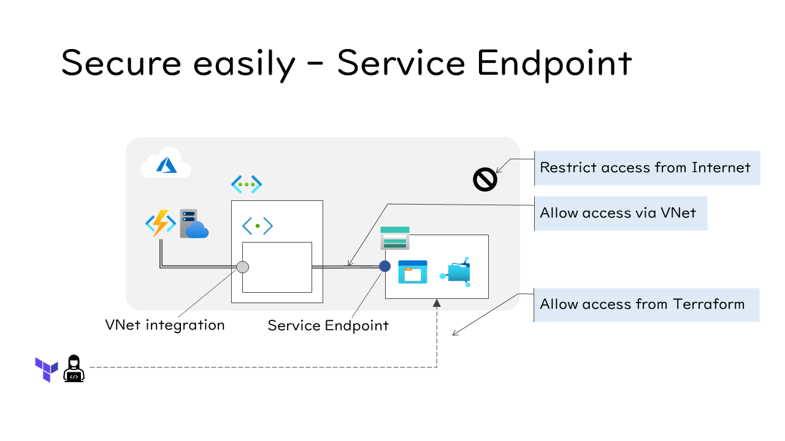

# Examples to learn various network options of Azure Functions

This repository includes examples below.

- Using Service Endpoint
- Using Private Endpoint

These examples can be deployed by Terraform.

## Azure Function Basic structure

First, let's confirm the basic structure of the Azure Function. Azure Function needs Azure App service plan and Storage account.

In this case, the Storage account's endpoints open to the public though that is secured by access keys or Shared Access Signature.

## Azure Functions access Storage account as Service Endpoint

Using Service Endpoint and virtual network restriction is an easy way to secure your routing from Azure Functions to Azure resources such as Storage Account.

See [README](./terraform/examples/service_endpoint/README.md) for details.

## Azure Functions access to Storage account via Private Endpint

Using Private Endpoint, you can route privately inside a virtual network.

When deploying the example environment, Terraform needs to be able to access the File share of the Storage Account in the private virtual network. So this repository also provides the environment to run Terraform in a virtual network that peers to the example's network.

See [README](./terraform/examples/private_endpoint/README.md) for details.
